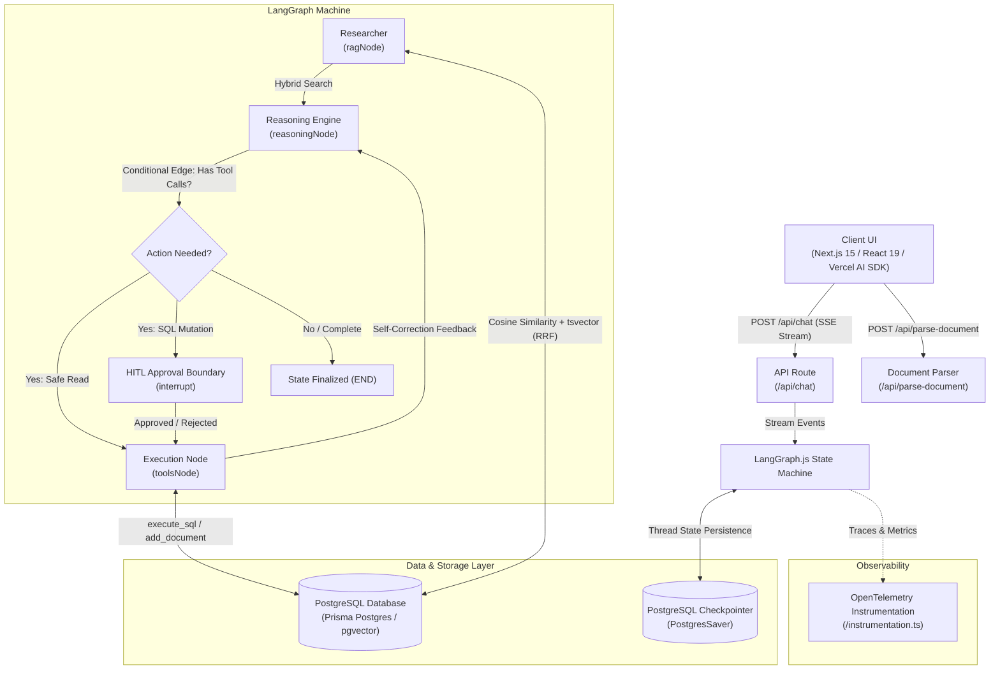

# System Architecture — Nexus Enterprise Knowledge Worker

## 1. High-Level Architecture Overview


---

## 2. Database Schema (PostgreSQL + pgvector)

### Models & Tables
1. **`documents` (`Document`)**
   - `id` (UUID, Primary Key)
   - `title` (Text)
   - `content` (Text)
   - `createdAt` (Timestamp)
   - `updatedAt` (Timestamp)
   - *Relations*: 1-to-many with `document_chunks`

2. **`document_chunks` (`DocumentChunk`)**
   - `id` (UUID, Primary Key)
   - `documentId` (UUID, FK -> `documents.id` ON DELETE CASCADE)
   - `content` (Text)
   - `embedding` (`vector(1536)` nullable)
   - `createdAt` (Timestamp)

3. **`chat_sessions` (`ChatSession`)**
   - `id` (UUID, Primary Key)
   - `title` (Text, Default: "New Chat")
   - `createdAt` (Timestamp)
   - `updatedAt` (Timestamp)
   - *Relations*: 1-to-many with `messages`

4. **`messages` (`Message`)**
   - `id` (UUID, Primary Key)
   - `chatId` (UUID, FK -> `chat_sessions.id` ON DELETE CASCADE)
   - `role` (Text: `"user"` | `"assistant"` | `"system"` | `"tool"`)
   - `content` (Text, sanitized for null bytes)
   - `createdAt` (Timestamp)

5. **`checkpoints` / `checkpoint_blobs` / `checkpoint_writes`**
   - Managed automatically by `@langchain/langgraph-checkpoint-postgres` for serverless state persistence.

---

## 3. Backend & Agent Routing Architecture

### API Routes
- `POST /api/chat`: Main AI agent stream endpoint. Handles user prompts, auto-session naming, LangGraph thread execution with `streamEvents`, HITL resumption tokens (`[HUMAN_APPROVAL_YES]` / `[HUMAN_APPROVAL_NO]`), and real-time SSE streaming.
- `POST /api/parse-document`: Multi-format document parser accepting `multipart/form-data` uploads (PDF via `pdf-parse`, TXT, MD, CSV, JSON, Source Code), sanitizing null bytes and bounding sizes up to 50k chars.

### LangGraph Directed Cyclic Graph Nodes & Edges
- **`ragNode`**: Extracts user intent, runs Reciprocal Rank Fusion (RRF) combining vector similarity + BM25 keyword matching via PostgreSQL `tsvector`, and injects citations into context.
- **`reasoningNode`**: Invokes LLM (OpenAI `gpt-4o`, Claude 3.5 Sonnet, DeepSeek R1, or Groq GPT-OSS 120B / Qwen 27B) with bound native tools (`add_document`, `execute_sql_query`, `execute_sql_mutation`, `web_search`).
- **`toolsNode`**: Executes in-process tools safely with OWASP table allowlisting, DuckDuckGo live internet search, error capture, and cyclic self-healing / response synthesis back to `reasoningNode`.
- **`webSearchTool`**: Live web search integration via DuckDuckGo with user-agent handling, HTML entity cleanup, snippet parsing, and direct link citations.
- **HITL Interrupt**: Halts graph execution on sensitive SQL mutations, prompts client for review, and resumes dynamically upon user confirmation.
- **Bounded Cyclic Self-Correction**: `AgentState.retryCount` tracks retry attempts; conditional edges bound retries to a maximum of 3 iterations to guarantee zero runaway loops.

---

## 4. Security, Resilience & Data Access Architecture

### 4.1 OWASP Table Whitelisting Layer (`src/lib/agent/tools.ts`)
- **Table Whitelist**: Enforces strict mutation allowlist (`documents`, `document_chunks`, `chat_sessions`, `messages`).
- **DML Allowlisting**: Restricts operations to `INSERT`, `UPDATE`, `DELETE`; rejects dangerous DDL (`DROP`, `ALTER`, `TRUNCATE`) and unauthorized schema mutations.
- **Null-Byte Sanitization**: Strips `\0` / `\u0000` bytes across inputs to protect PostgreSQL text encoding.

### 4.2 Serverless Connection Pool Management (`src/lib/db/prisma.ts`)
- **Bounded Pool Configuration**: Node `pg.Pool` configured with `max: 5`, `idleTimeoutMillis: 30000`, and `connectionTimeoutMillis: 5000` for Vercel Serverless Function cold-start efficiency and connection leak prevention.
- **Batch Chunk Ingestion**: Ingests document chunks via transactional `$transaction` using `createMany`, optimizing database round-trips.

### 4.3 Anti-Buffering Stream Response Pipeline (`src/app/api/chat/route.ts`)
- **SSE Anti-Buffering Headers**: Enforces `X-Accel-Buffering: no` and `Cache-Control: no-cache, no-transform` on the HTTP response stream to prevent Nginx, Cloudflare, and Vercel Edge proxies from compressing or batching in-flight tokens.
- **Polymorphic Chunk Delta Extraction**: Handles both `on_chat_model_stream` and `chat_model` stream events in LangGraph to reliably extract text token chunks across heterogeneous LLM providers (OpenAI, Anthropic Claude, Groq LLaMA).

### 4.4 Rich Markdown, Stream-Safe Table Parser & 3D Citation Deck (`src/components/message-bubble.tsx`, `src/components/citation-drawer.tsx`)
- **Zero-Dependency Markdown Engine**: Parses headers (`#`, `##`, `###`), bold/italics, bullet lists, inline code, and syntax-highlighted code blocks with 1-click clipboard copy.
- **Stream-Safe Table Parsing**: Dynamically calculates table header column count and automatically synthesizes in-flight placeholder cells (`<td>`) for partially completed rows during token streaming, preventing DOM thrashing and layout flickering.
- **3D Card Stack & Citation Drawer**: Renders retrieved RAG sources as an overlapping 3D card deck with depth offsets (`translate-y-1.5 translate-x-1.5`), quick preview snippets, and an interactive slide-over `CitationDrawer` for deep document inspection.

### 4.5 Sense AI Design System Tokens (`src/app/globals.css`)
- **Obsidian Palette**: Dark canvas `#0b0f19`, frosted slate surface `rgba(14, 19, 31, 0.65)` with `backdrop-blur-2xl` and subtle borders `rgba(255, 255, 255, 0.08)`.
- **Ambient Lighting**: Multi-point radial gradients with subtle indigo/blue glows (`.ambient-radial-glow`) and animated fluid mesh accents.
- **Squircle & Pill Geometry**: Modern `rounded-3xl` modal containers, floating search pills, and pill-shaped quick action triggers.

---

## 5. Frontend Component Tree & UI Structure

```
src/
├── app/
│   ├── layout.tsx         # Root layout with JetBrains Mono + Inter fonts, Theme & OTel provider
│   ├── page.tsx           # Main workspace orchestration, handles chat state & stream events
│   ├── chat-actions.ts    # Server actions for sessions (list, create, delete, rename, message history)
│   └── globals.css        # Sense AI deep obsidian & frosted slate design tokens & animations
├── components/
│   ├── chat-input.tsx     # Floating omni-search bar, suggestion pills, document attachment, model selector
│   ├── message-list.tsx   # Message container, Sense AI hero greeting, 1-Click Interactive Feature Cards
│   ├── message-bubble.tsx # Sense AI message bubbles, 3D citation card deck, stream-safe markdown tables
│   ├── citation-drawer.tsx# Slide-over inspector for deep RAG source citations and document metadata
│   ├── sidebar.tsx        # Vertical 5-action icon rail, session history drawer, new chat trigger
│   ├── approval-modal.tsx # Human-in-the-loop action approval modal for SQL mutations
│   ├── telemetry-modal.tsx# Live LangGraph execution traces & state machine inspector
│   └── toast.tsx          # Non-intrusive floating feedback alerts
└── lib/
    ├── agent/
    │   ├── graph.ts       # LangGraph cyclic state machine construction & PostgreSQL checkpointer
    │   ├── state.ts       # AgentState interface with messages, citations, retryCount, and isApproved
    │   └── tools.ts       # Native LangChain tools with OWASP table allowlist & batch transaction support
    └── db/
        ├── prisma.ts      # Prisma Client & bounded pg Pool singleton instance
        └── hybrid-search.ts # Hybrid RRF search (pgvector cosine + tsvector keyword matching)
```
