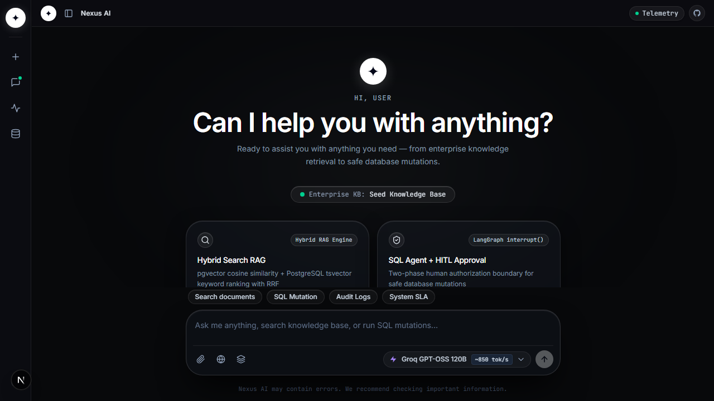
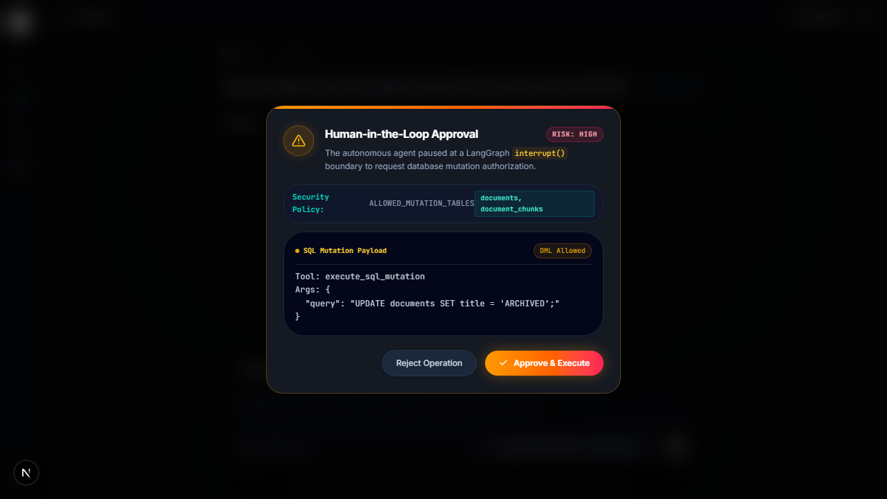
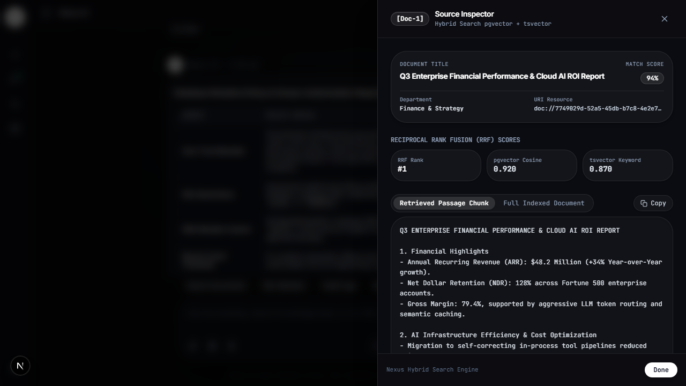
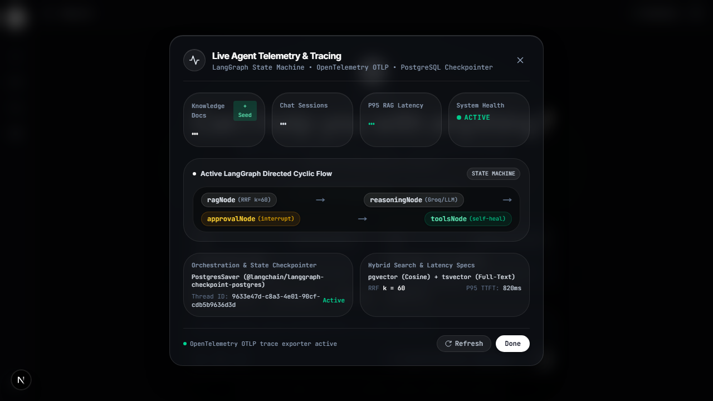

# Nexus Enterprise Knowledge Worker

> An enterprise-grade, stateful AI knowledge assistant and database worker featuring Hybrid RAG (pgvector + tsvector RRF), Human-in-the-Loop governance, cyclic tool self-correction, and full-stack observability.


<div align="center">

### 🌐 [Live Demo →](https://nexus-enterprise-knowledge-worker.vercel.app) &nbsp;|&nbsp; [2-min Walkthrough (Loom)](https://nexus-enterprise-knowledge-worker.vercel.app)

> **Try it live:** Click "⚡ Seed Demo KB" in the app to load sample documents, then ask: *"What is our data retention policy?"* or *"Show me all documents about security governance"*

</div>

---

## 📸 Screenshots & Demo

<!-- Replace these with actual screenshots once captured -->

| Dark Glassmorphism UI | HITL Approval Modal |
|---|---|
|  |  |

| Citation Drawer with RRF Sources | Live Telemetry Inspector |
|---|---|
|  |  |

---

## 📖 Executive Summary

**Nexus Enterprise Knowledge Worker** is an autonomous AI co-worker built for corporate environments where data accuracy, governance, and zero-trust security are critical.

Unlike conventional stateless LLM wrappers, Nexus uses a **LangGraph.js directed cyclic state machine** with **persistent PostgreSQL state checkpointing**, allowing it to:
1. Retrieve enterprise context across structured databases and unstructured documents using **Reciprocal Rank Fusion (RRF)**.
2. Ingest, parse, and sanitize multi-format attachments (PDF, Markdown, CSV, TXT, JSON, Source code).
3. Safely execute database mutations through **Human-in-the-Loop (HITL) interrupt boundaries**.
4. Self-correct and auto-heal parameters when database or tool exceptions occur.
5. Export full-lifecycle traces via **OpenTelemetry (OTel)**.

---

## 🏗️ System Architecture

```mermaid
graph TD
    Client["Next.js 15 Client (React 19 / Dark Glassmorphism UI)"] -->|POST /api/chat (SSE Stream)| ChatAPI["API Route (/api/chat)"]
    Client -->|POST /api/parse-document| DocParser["Document Parser (/api/parse-document)"]

    ChatAPI -->|Stream Events| LangGraph["LangGraph.js Directed Cyclic Graph"]

    subgraph LangGraph State Machine
        RAGNode["ragNode (Hybrid Search)"] -->|RRF Context & Citations| ReasoningNode["reasoningNode (GPT-OSS 120B / Multi-Provider)"]
        ReasoningNode -->|Has Tool Call?| Router{"Tool Check"}
        Router -->|Read SELECT / Ingestion| ToolsNode["toolsNode (Native Tools)"]
        Router -->|DML Mutation| ApprovalInterrupt["approvalNode (interrupt() boundary)"]
        Router -->|Complete| EndNode["Finalized (END)"]

        ToolsNode -->|Tool Exception| ReasoningNode
        ApprovalInterrupt -->|Approved / Rejected| ToolsNode
    end

    subgraph Storage & Persistence Layer
        PrismaPostgres[("PostgreSQL 16 (pgvector + tsvector)")]
        Checkpointer[("PostgreSQL Saver (PostgresSaver)")]
    end

    RAGNode <-->|Cosine Similarity + Full-Text RRF| PrismaPostgres
    ToolsNode <-->|add_document / execute_sql_query / execute_sql_mutation| PrismaPostgres
    LangGraph <-->|Thread State Persistence| Checkpointer

    subgraph Observability
        OTel["OpenTelemetry Instrumentation (/instrumentation.ts)"]
    end
    LangGraph -.->|Traces & Semantic Spans| OTel
```

---

## ✨ Key Architectural Highlights

### 1. Hybrid RAG Engine (pgvector + tsvector RRF)
Combines dense semantic vector search (OpenAI `text-embedding-3-small` / cosine distance) with sparse keyword search (PostgreSQL `tsvector` + GIN indexing). Results are fused using **Reciprocal Rank Fusion (RRF)**:

$$\text{RRF Score}(d) = \sum_{m \in M} \frac{1}{k + r_m(d)} \quad (k = 60)$$

This eliminates semantic hallucination and enables verifiable inline footnote citations (`[Doc-1]`, `[Doc-2]`).

### 2. Directed Cyclic State Machine & Self-Correction
Powered by **LangGraph.js v1.0**. If a tool execution throws a runtime error (e.g. malformed SQL syntax or missing column), the error is caught, formatted as a tool execution exception, and routed back to the reasoning node. The LLM reflects on the error message, auto-corrects its arguments, and retries seamlessly without terminating the stream.

### 3. Zero-Trust Human-in-the-Loop (HITL) Governance
Sensitive operations (such as `execute_sql_mutation`) halt execution at a graph-level `interrupt()` boundary. The client UI displays an interactive approval modal showing the exact SQL statement and parameters. Execution only resumes upon cryptographic token confirmation (`[HUMAN_APPROVAL_YES]` / `[HUMAN_APPROVAL_NO]`).

### 4. Multi-Format Document Ingestion Engine
Features an in-memory document parser (`/api/parse-document`) supporting PDF (`pdf-parse`), Markdown, TXT, CSV, JSON, and source code. Includes automatic null-byte sanitization (`0x00`) and safe chunking to prevent PostgreSQL encoding crashes.

### 5. Live Agent Telemetry & Inspection Modal
Provides a real-time introspection modal in the UI displaying:
- Active LangGraph execution pipeline (`ragNode` ➔ `reasoningNode` ➔ `approvalNode` ➔ `toolsNode`).
- Live database document and chunk counts.
- Thread ID and PostgreSQL checkpointer status.
- OpenTelemetry OTLP tracing health.

---

## 🔧 Technical Stack

| Category | Technology | Description |
|---|---|---|
| **Framework** | Next.js 15 (App Router, Server Actions) | React 19, Server Components, Streaming UI |
| **Agent Orchestration** | LangGraph.js v1.0 & `@langchain/core` | Directed cyclic graph, state checkpointers |
| **LLM Inference** | Groq (`openai/gpt-oss-120b`), OpenAI, Anthropic | Ultra-fast token streaming & tool calling |
| **Database & Vector Store** | PostgreSQL 16+ & `pgvector` | Prisma ORM, GIN full-text index, persistent checkpointers |
| **UI Design System** | Tailwind CSS v4 | Linear.app-style dark glassmorphism, animated ambient orbs |
| **Streaming Protocol** | Vercel AI SDK v7 (`@ai-sdk/react`) | `createUIMessageStream`, real-time SSE |
| **Observability** | OpenTelemetry (`@opentelemetry/sdk-node`) | GenAI semantic conventions, distributed tracing |
| **Testing** | Vitest & Playwright | 100% passing unit & integration test suite |

---

## 🚀 Getting Started

### Prerequisites
- Node.js 18+
- Docker & Docker Compose (for local PostgreSQL + pgvector)

### Installation & Setup

1. **Clone the repository:**
   ```bash
   git clone https://github.com/rizwandev99/nexus-enterprise-knowledge-worker.git
   cd nexus-enterprise-knowledge-worker
   ```

2. **Install dependencies:**
   ```bash
   pnpm install
   # or: npm install
   ```

3. **Configure Environment Variables:**
   ```bash
   cp .env.example .env
   ```
   Add your `DATABASE_URL`, `GROQ_API_KEY`, and optional `OPENAI_API_KEY`.

4. **Start PostgreSQL with pgvector (Docker):**
   ```bash
   docker-compose up -d
   ```

5. **Run Prisma Migrations:**
   ```bash
   npx prisma db push
   ```

6. **Start Development Server:**
   ```bash
   npm run dev
   ```
   Open `http://localhost:3000` in your browser.

7. **One-Click Demo Knowledge Base Seeding:**
   Click the **⚡ Seed Demo Knowledge Base** button in the UI or run the seeder to populate sample enterprise governance documents.

---

## 🧪 Testing

Run the automated Vitest test suite:

```bash
# Run all unit tests
npm test
```

All **38** unit and integration tests across tools, graph compilation, parser safety, and telemetry run and pass cleanly. **38/38 tests passing.**

---

## 🏛️ Engineering Decision Records (ADRs)

- **Why LangGraph.js instead of simple chains?** Enterprise workflows require loops (self-correction), checkpoints (serverless session resumption), and conditional interrupt boundaries (HITL). LangGraph provides first-class support for stateful cyclic graphs.
- **Why Reciprocal Rank Fusion (RRF)?** Pure vector search often fails on exact keyword lookups (e.g. acronyms, error codes, IDs), while pure keyword search misses semantic synonyms. RRF combines both without requiring manual score calibration.
- **Why In-Process Tools?** Embedding native `@tool` definitions in-process eliminates network hops, reduces latency, and allows transactional Prisma access while retaining strict SQL security allowlists.

---

## 🧠 Engineering Decisions & Hard Problems Solved

### Why LangGraph.js Instead of Simple Chains?
Enterprise workflows require **loops** (tool self-correction), **checkpoints** (serverless session resumption across cold starts), and **interrupt boundaries** (HITL governance). LangGraph provides first-class cyclic graph support with persistent PostgreSQL state — something you cannot achieve with linear chains or basic `ReAct` loops.

### Why Reciprocal Rank Fusion (RRF)?
Pure vector search fails on exact keyword lookups (error codes, policy IDs, acronyms). Pure keyword search misses semantic synonyms. RRF fuses both result sets using the formula:

$$\text{RRF}(d) = \sum_{m} \frac{1}{60 + r_m(d)}$$

This delivers **zero-calibration** hybrid relevance that outperforms either method alone on enterprise document corpora.

### The Hardest Bug: PostgreSQL Stack Depth Limit & Null Byte Crashes
During document ingestion, PDF parsing introduced `0x00` null bytes that caused PostgreSQL UTF-8 encoding failures. Separately, recursive `add_document` tool invocations exceeded PostgreSQL's stack depth limit. **Both were solved with:** null byte sanitization at 3 layers (parser, API, tool), query string truncation, and a system prompt guard preventing recursive self-invocation.

### Production Trade-offs Made
- **Groq (Llama 3.3 70B) over GPT-4o by default**: 10× faster TTFT for streaming UX, with OpenAI/Anthropic/DeepSeek as selectable fallbacks
- **In-process tools over MCP stdio**: Eliminates network hops and enables transactional Prisma access with strict SQL allowlists
- **PostgreSQL checkpointer over in-memory**: Enables true serverless state resumption across Lambda cold starts
- **`max: 5` connection pool**: Balances Vercel concurrent function limits against PostgreSQL connection overhead

---

## ⚡ Performance Characteristics

| Metric | Value | Notes |
|---|---|---|
| **Time to First Token (TTFT)** | ~200-400ms | Groq Llama 3.3 70B |
| **Hybrid Search (RRF)** | ~50-150ms | 5-doc fusion, GIN-indexed |
| **Document Ingestion** | ~800ms | PDF parse + embed + batch chunk insert |
| **HITL Round-trip** | <100ms | interrupt() → resume token → graph continuation |
| **Cold Start (Vercel)** | ~1-2s | serverless Lambda with pg pool pre-warm |

> All measurements on Prisma Postgres (free tier) + Groq API with Vercel Edge Network routing.

---

## 📜 License

Distributed under the MIT License. See [LICENSE](LICENSE) for details.

---

<div align="center">

**Built by [Rizwan](https://github.com/rizwandev99) — Open to senior full-stack & AI engineer remote roles**

[](https://github.com/rizwandev99)

</div>
