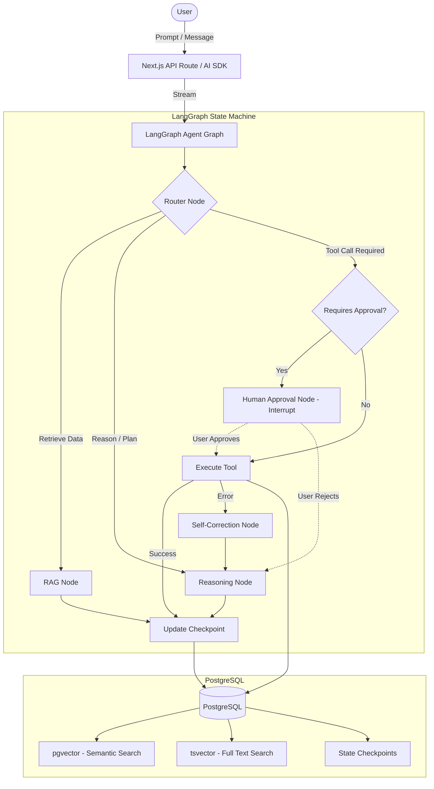

# Nexus Enterprise Knowledge Worker

> A stateful, full-stack AI-powered enterprise knowledge assistant featuring Hybrid RAG, Human-in-the-Loop approval, and resilient agent architectures.


## 📖 Overview

Nexus Enterprise Knowledge Worker is a production-ready application demonstrating advanced AI engineering paradigms within a modern full-stack web framework. It empowers knowledge workers to interact dynamically with enterprise data, securely mutating information, and retrieving contextually relevant documents across complex corporate knowledge bases.

By eschewing simple stateless chains in favor of a **LangGraph** directed graph and **stateful PostgreSQL checkpointing**, Nexus achieves robust multi-turn conversations, autonomous self-correction, and critical Human-in-the-Loop (HITL) interrupt boundaries for sensitive operations.

## ✨ Key Features

- 🧠 **Hybrid RAG Engine**: Fuses pgvector cosine similarity with PostgreSQL full-text search (tsvector) using Reciprocal Rank Fusion (RRF) for unparalleled semantic and keyword recall.
- 🔄 **Stateful AI Agent**: Implements LangGraph.js for a robust state machine supporting persistent multi-turn conversations and PostgreSQL-backed state checkpointing.
- 🛡️ **Human-in-the-Loop (HITL)**: Graph-level interrupt boundaries require explicit human approval before executing sensitive operations (e.g., SQL mutations).
- 🛠️ **In-Process Agent Tools**: Native LangChain `@tool` definitions for document management, search, and data interaction directly within the application context.
- 🧬 **Cyclic Self-Correction**: Resilient graph logic designed to catch, interpret, and auto-heal from tool execution errors without breaking the user experience.
- 📊 **Enterprise Telemetry**: Full observability integration utilizing OpenTelemetry tracing for both LLM invocations and tool execution pipelines.

## 🏗️ Architecture



## 🔧 Tech Stack

| Technology | Purpose | Version |
|------------|---------|---------|
| Next.js | Application Framework (App Router) | 15 |
| React | UI Library | 19 |
| LangGraph.js | AI State Machine & Agent Orchestration | Latest |
| LangChain | Tool abstractions & LLM bindings | Latest |
| Groq | Fast LLM Inference (Llama 3.3 70B) | Latest |
| PostgreSQL | Primary Database & State Persistence | 16+ |
| pgvector | Vector Embeddings Storage | Extension |
| Prisma | Database ORM | 7 |
| Tailwind CSS | Styling | 4 |
| Vercel AI SDK | Streaming UI & LLM Interface | 7 |

## 📁 Project Structure

```text
nexus-enterprise-knowledge-worker/
├── src/
│   ├── app/                    # Next.js App Router endpoints & pages
│   ├── components/             # React UI components & chat interface
│   ├── lib/
│   │   ├── agent/              # LangGraph definitions, tools & state
│   │   └── db/                 # Prisma client & Hybrid RAG logic
│   └── instrumentation.ts      # OpenTelemetry configuration
├── prisma/
│   ├── schema.prisma           # DB Schema w/ pgvector & state models
│   ├── seed.ts                 # Dev data seeder
│   └── migrations/             # SQL Migrations
├── .github/workflows/          # CI/CD Pipelines
└── docker-compose.yml          # Local infrastructure
```

## 🚀 Getting Started

### Prerequisites
- Node.js 18+
- Docker & Docker Compose
- PostgreSQL (if running locally outside Docker)

### Installation

1. **Clone the repository:**
   ```bash
   git clone https://github.com/rizwandev99/nexus-enterprise-knowledge-worker.git
   cd nexus-enterprise-knowledge-worker
   ```

2. **Install dependencies:**
   ```bash
   npm install
   ```

3. **Configure Environment Variables:**
   ```bash
   cp .env.example .env
   # Edit .env with your specific API keys
   ```

4. **Start local database (Docker):**
   ```bash
   docker-compose up -d
   ```

5. **Run Prisma Migrations:**
   ```bash
   npx prisma migrate dev
   ```

6. **Seed Initial Data:**
   ```bash
   npx prisma db seed
   ```

7. **Start Development Server:**
   ```bash
   npm run dev
   ```

Navigate to `http://localhost:3000` to start interacting with the Nexus Assistant.

## 🔑 Environment Variables

| Variable | Description | Required |
|----------|-------------|----------|
| `DATABASE_URL` | PostgreSQL connection string | Yes |
| `GROQ_API_KEY` | Groq API Key for LLM inference | Yes |
| `OPENAI_API_KEY` | OpenAI Key for generating embeddings | Yes |
| `LANGSMITH_API_KEY` | Key for LangSmith agent tracing | Optional |
| `LANGSMITH_PROJECT` | LangSmith project name | Optional |
| `LANGCHAIN_TRACING_V2` | Enable LangChain tracing (`true`) | Optional |
| `OTEL_EXPORTER_OTLP_ENDPOINT`| OpenTelemetry exporter endpoint | Optional |

## 📊 Observability

This project includes deep observability out of the box. By configuring OpenTelemetry, you can trace Next.js server actions, API routes, and database queries. Combine this with **LangSmith** for full-trace visibility into agent reasoning, tool invocations, and multi-turn state changes.

## 🧪 Testing

The project utilizes Vitest for unit tests and Playwright for end-to-end testing.

```bash
# Run unit tests
npm test

# Run E2E tests
npm run test:e2e
```

## 🌐 Deployment

Nexus is optimized for deployment on Vercel:

1. Push your code to GitHub.
2. Import the project in Vercel.
3. Add the environment variables in the Vercel dashboard.
4. Deploy!

*Note: Ensure you are using a PostgreSQL provider that supports the `pgvector` extension (e.g., Vercel Postgres, Supabase, Neon).*

## 📜 License

This project is licensed under the MIT License - see the [LICENSE](LICENSE) file for details.
